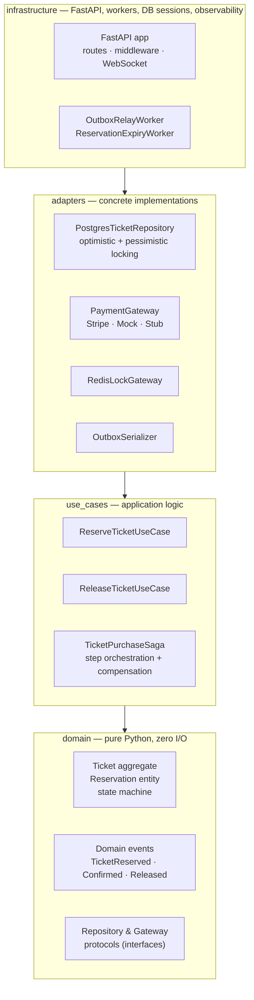
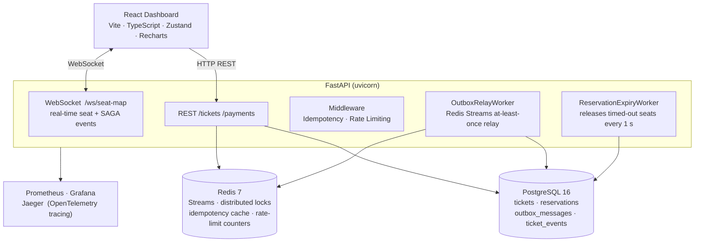
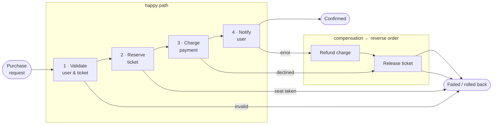

# ReserveX

ReserveX is a portfolio reservation and payment platform built around async Python,
FastAPI, PostgreSQL, Redis, and a React dashboard. The main goal is to demonstrate
clean backend architecture, concurrency control, and transactional reliability patterns
through a fully working live demo.

## Live Demo

**[https://reservex-production-b7e8.up.railway.app/](https://reservex-production-b7e8.up.railway.app/)**

Deployed on Railway. PostgreSQL and Redis are live — every button triggers real
backend operations (locking, SAGA steps, compensation). No login required.

---

## What It Demonstrates

- Clean Architecture layers: `domain → use_cases → adapters → infrastructure`
- Ticket aggregate with reservation lifecycle and domain events
- PostgreSQL `SELECT FOR UPDATE` plus optimistic version checks
- Transactional outbox writes in the same transaction as ticket changes
- Redis Streams outbox relay for at-least-once event publishing
- Reservation expiry worker that releases expired seats through the aggregate
- SAGA orchestration with compensating transactions for payment failure
- FastAPI with structured logging, Prometheus metrics, OpenTelemetry, rate limiting,
  idempotency middleware, and WebSocket fan-out
- React/Vite dashboard with typed WebSocket message parsing and scenario controls
- Unit, integration, property-based, and load-smoke test coverage

---

## Dashboard Walkthrough

Open the live URL. The page loads a 50-seat event and connects via WebSocket.
Everything updates in real time — no manual refresh needed.

### Seat Map

The grid at the top shows all 50 seats colour-coded by state:

| Colour | State | Meaning |
|--------|-------|---------|
| Green | `AVAILABLE` | Can be reserved |
| Yellow | `RESERVED` | Held, pending payment |
| Blue | `CONFIRMED` | Payment complete |
| Red | `RELEASED` | Expired or cancelled, back to available |

Seats transition automatically as you trigger scenarios. An expiry worker runs
every second on the backend — yellow seats turn red then green on their own if a
purchase is not completed in time.

### Scenario Panel

Click any button to run a backend scenario. Results appear live in the Seat Map,
SAGA Visualizer, and Event Log.

| Button | What it does | What to watch |
|--------|-------------|---------------|
| **Single Reserve** | Reserves one seat through the full SAGA | SAGA steps light up one by one; seat turns yellow then blue |
| **Race Condition** | 10 concurrent requests target the same seat | Only 1 succeeds; the rest fail with `TicketAlreadyTaken`; Event Log shows the conflict errors |
| **Payment Failure** | SAGA reaches the charge step then fails | Seat reserved (yellow) → compensation fires → seat released (green); SAGA shows the rollback path |
| **Timeout Demo** | Reserves a seat and waits for expiry | Timeout bar counts down; expiry worker releases the seat automatically |
| **Bulk Reserve** | Reserves multiple seats concurrently | Seat map fills rapidly; semaphore gauge shows queued requests |

### SAGA Visualizer

Shows the four purchase steps in real time:

```
Validate → Reserve → Charge → Notify
```

Green = completed, red = failed, grey = compensating transaction fired.
Trigger **Payment Failure** to see the compensation path in action.

### Event Log

Tail of the last 60 backend events broadcast over WebSocket.
Colour-coded by level (info / warning / error). Useful for seeing the exact
sequence of lock acquisitions, SAGA transitions, and compensation calls.

### Metrics Dashboard

Live throughput graph (requests/sec) and a latency histogram updated as you
trigger scenarios. Data comes from the same WebSocket stream — no polling.

### Concurrency Layers & Semaphore Gauge

Shows which concurrency model is active (asyncio event loop, thread pool,
process pool) and how many requests are currently active vs. queued behind
the semaphore. Most visible during **Bulk Reserve**.

### Timeout Bar

Animated countdown showing the remaining TTL on the most recent reservation.
Resets each time a new reservation is made.

---

## Architecture

### Clean Architecture Layers

Dependencies flow strictly inward — domain has no external imports; infrastructure wires everything.



### System Components



### SAGA Orchestration (Payment Flow)

Each step has a compensating transaction; compensation runs in reverse order on failure.



### Source Layout

```text
src/domain          pure domain model, events, exceptions, protocols
src/use_cases       application workflows and SAGA orchestration
src/adapters        repository and gateway implementations
src/infrastructure  FastAPI, database, observability, workers
frontend            React dashboard
tests               unit, integration, and load-smoke tests
```

The default local API wiring uses mock/stub payment and notification gateways so
the project can run without external accounts. A Stripe adapter exists in
`src/adapters/gateways/stripe_gateway.py`, but production payment wiring is not
enabled by default.

---

## Local Setup

```bash
cp .env.example .env
make dev
uv run alembic upgrade head
PYTHONPATH=src uv run uvicorn infrastructure.api.main:app --reload
```

In another terminal:

```bash
cd frontend
npm install
npm run dev
```

Open the Vite URL shown by `npm run dev`. The frontend proxies `/api`, `/ws`,
and `/metrics` to the backend on `localhost:8000`.

For the full Docker stack (API + PostgreSQL + Redis + Prometheus + Grafana + Jaeger):

```bash
make dev-full
```

---

## Verification

Backend:

```bash
uv run ruff check .
uv run mypy src/
uv run pytest tests/unit -q
uv run pytest tests/integration -q
uv run pytest tests/load -q
```

Frontend:

```bash
cd frontend
npm run lint
npm test
npm run build
```

Manual load profile:

```bash
uv run locust -f tests/load/locustfile.py --host http://localhost:8000
```

Set `RESERVEX_LOAD_EVENT_ID` and `RESERVEX_LOAD_TICKET_IDS` when targeting seeded
ticket data.

---

## Current Scope

ReserveX is a backend/concurrency portfolio project with a frontend demo.
It is not a complete commercial ticketing product. Known non-goals in the
current version include user authentication, a real checkout UI, production
Stripe credential wiring, and production-grade auth/tenant isolation.